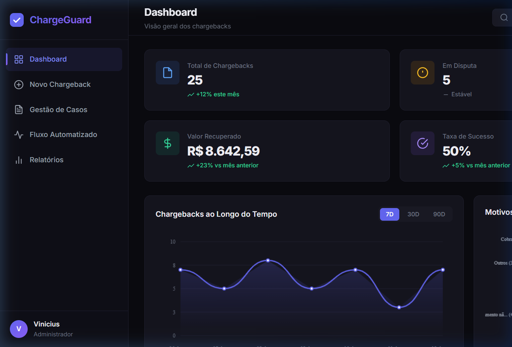
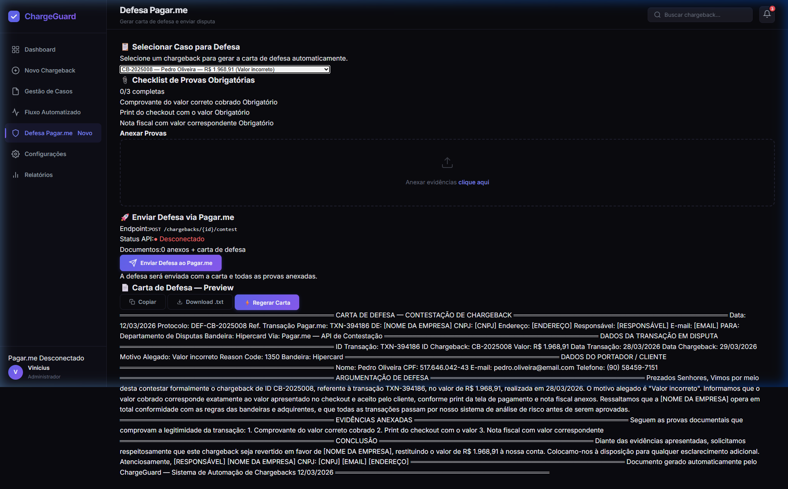
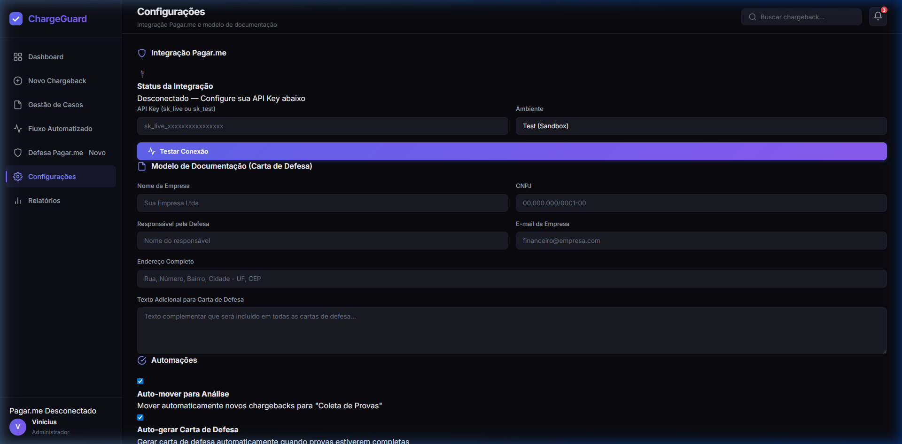
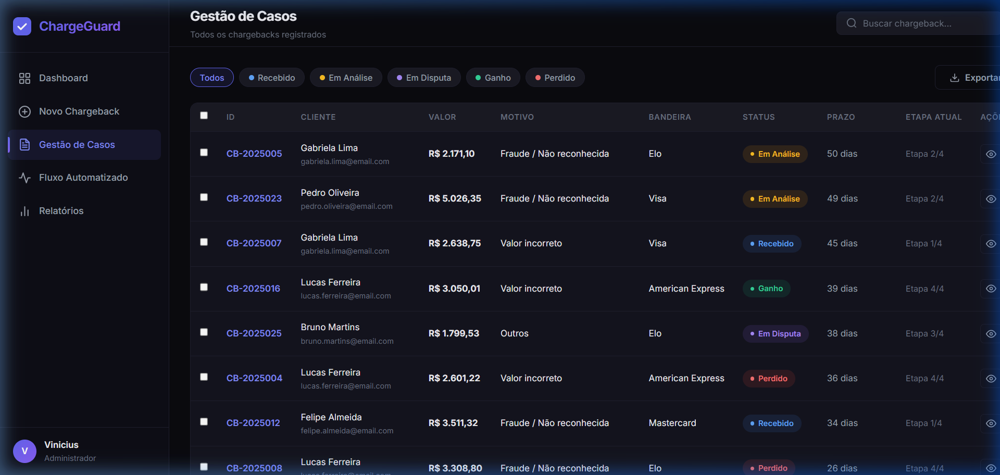
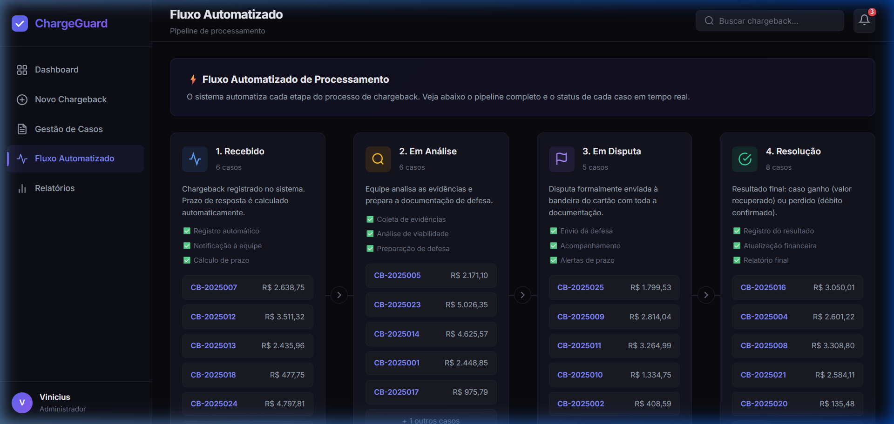
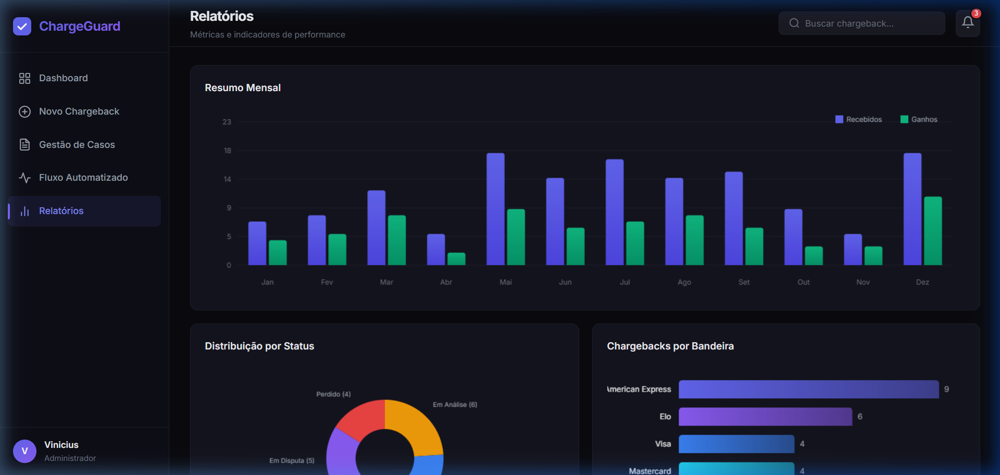
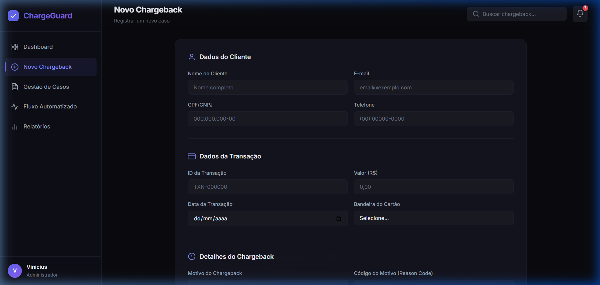
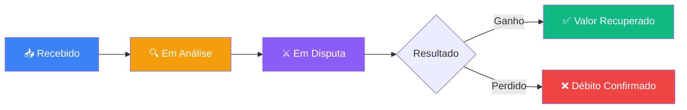

<p align="center">
  
  
  
  
</p>

<h1 align="center">⚡ ChargeGuard</h1>

<p align="center">
  <strong>Sistema de Automação de Chargebacks integrado com Pagar.me</strong>
  <br>
  Geração automática de carta de defesa • Checklist de provas por motivo • Pipeline visual • Relatórios analíticos
</p>

---

## 📖 Sobre o Projeto

O **ChargeGuard** é um sistema completo de automação e gestão de chargebacks, projetado para empresas que utilizam o **Pagar.me** como gateway de pagamento. O sistema automatiza o processo de defesa, desde o registro do chargeback até o envio da contestação, incluindo:

- 🏗️ **Pipeline visual** com 4 etapas automatizadas
- 📄 **Geração automática de carta de defesa** personalizada com dados da empresa
- 📋 **Checklist inteligente de provas** baseado no motivo do chargeback
- 🚀 **Envio integrado** da defesa via API do Pagar.me
- 📊 **Dashboard e relatórios** com gráficos interativos e KPIs
- ⚙️ **Configurações flexíveis** de automação e modelo de documentação

---

## 🖥️ Screenshots

### Dashboard

> Visão geral com métricas em tempo real: Total de Chargebacks, Em Disputa, Valor Recuperado e Taxa de Sucesso.

### Defesa Pagar.me

> Seleção de caso → Checklist de provas obrigatórias → Carta de defesa gerada automaticamente → Envio via API.

### Configurações

> Integração com API Pagar.me, modelo de documentação da empresa e automações configuráveis.

### Gestão de Casos

> Tabela interativa com filtros por status, indicador de provas coletadas e ações rápidas.

### Fluxo Automatizado

> Pipeline Kanban integrado com Pagar.me: registro → coleta de provas → defesa → resolução.

### Relatórios

> Gráficos de resumo mensal, distribuição por status, volume por bandeira e KPIs animados.

### Novo Chargeback

> Formulário completo com dados do cliente, transação Pagar.me e upload de evidências.

---

## 🚀 Como Usar

### Pré-requisitos

- Navegador moderno (Chrome, Firefox, Edge)
- [Node.js](https://nodejs.org/) instalado (apenas para o servidor local)

### Instalação

```bash
# 1. Clone o repositório
git clone https://github.com/seu-usuario/chargeguard.git

# 2. Entre na pasta do projeto
cd chargeguard

# 3. Inicie o servidor local
npx -y http-server . -p 8080 --cors

# 4. Acesse no navegador
# http://localhost:8080
```

> **💡 Alternativa:** Você pode abrir o `index.html` diretamente no navegador, sem servidor.

---

## ⚙️ Configuração Inicial

### 1. Dados da Empresa

Acesse **Configurações** no menu lateral e preencha:

| Campo | Descrição |
|-------|-----------|
| **Nome da Empresa** | Razão social que aparece na carta de defesa |
| **CNPJ** | CNPJ da empresa |
| **Responsável pela Defesa** | Nome do profissional que assina as cartas |
| **E-mail da Empresa** | E-mail de contato para disputas |
| **Endereço Completo** | Endereço que constará na documentação |
| **Texto Adicional** | Texto extra incluído em todas as cartas |

### 2. Integração Pagar.me

1. Obtenha sua **API Key** no [Dashboard do Pagar.me](https://dashboard.pagar.me/)
2. Cole a chave no campo **API Key** (`sk_live_...` ou `sk_test_...`)
3. Selecione o **Ambiente** (Sandbox para testes, Produção para uso real)
4. Clique em **Testar Conexão**

### 3. Automações

| Automação | Descrição | Padrão |
|-----------|-----------|--------|
| **Auto-mover para Análise** | Move novos chargebacks automaticamente para "Coleta de Provas" | ✅ Ativo |
| **Auto-gerar Carta de Defesa** | Gera carta quando todas as provas são coletadas | ✅ Ativo |
| **Alertas de Prazo** | Notificações quando faltam 3 dias para vencimento | ✅ Ativo |
| **Auto-envio Pagar.me** | Envia defesa automaticamente quando tudo está pronto | ❌ Inativo |

---

## 📄 Carta de Defesa Automática

O sistema gera automaticamente uma **carta de defesa formal** para cada chargeback, contendo:

```
══════════════════════════════════════════════
   CARTA DE DEFESA — CONTESTAÇÃO DE CHARGEBACK
══════════════════════════════════════════════

Data: [data atual]
Protocolo: DEF-[ID do chargeback]
Ref. Transação Pagar.me: [ID da transação]

DE: [Dados da sua empresa]
PARA: Departamento de Disputas — Via Pagar.me

═══ DADOS DA TRANSAÇÃO EM DISPUTA ═══
═══ DADOS DO PORTADOR / CLIENTE ═══
═══ ARGUMENTAÇÃO DE DEFESA ═══        ← Personalizada por motivo
═══ EVIDÊNCIAS ANEXADAS ═══           ← Lista do checklist
═══ CONCLUSÃO ═══

Assinatura: [Responsável configurado]
```

A **argumentação é gerada automaticamente** conforme o motivo do chargeback:

| Motivo | Argumentação Automática |
|--------|------------------------|
| Fraude | Comprovação de autenticação, IP, device fingerprint, entrega |
| Produto não recebido | Código de rastreamento, comprovante de entrega |
| Produto diferente | Descrição do produto, fotos, página do site |
| Cobrança duplicada | IDs distintos no Pagar.me, NFs separadas |
| Cancelamento | Termos de uso, logs de acesso, serviço prestado |
| Valor incorreto | Print do checkout, nota fiscal correspondente |
| Serviço não prestado | Logs de uso, contrato, e-mails de suporte |

---

## 📋 Checklist de Provas por Motivo

Cada motivo de chargeback possui um **checklist específico** de provas obrigatórias e recomendadas:

<details>
<summary><strong>🔴 Fraude / Transação não reconhecida</strong></summary>

- ✅ Comprovante de entrega com assinatura (Obrigatório)
- ✅ Log de IP e device fingerprint da compra (Obrigatório)
- ✅ Confirmação de e-mail do pedido (Obrigatório)
- ✅ Nota fiscal eletrônica — NF-e (Obrigatório)
- 📎 Histórico de compras anteriores do cliente (Recomendado)
- 📎 Screenshot do antifraude aprovando a transação (Recomendado)
</details>

<details>
<summary><strong>📦 Produto não recebido</strong></summary>

- ✅ Comprovante de entrega — AR/tracking (Obrigatório)
- ✅ Código de rastreamento com status entregue (Obrigatório)
- ✅ Nota fiscal eletrônica — NF-e (Obrigatório)
- 📎 Print do status de entrega da transportadora (Recomendado)
- 📎 E-mail de confirmação de envio ao cliente (Recomendado)
</details>

<details>
<summary><strong>🔄 Cobrança duplicada</strong></summary>

- ✅ Comprovante de que são transações distintas (Obrigatório)
- ✅ IDs das transações no Pagar.me (Obrigatório)
- ✅ Notas fiscais de cada transação (Obrigatório)
- 📎 Comprovante de entrega de cada pedido (Recomendado)
</details>

<details>
<summary><strong>💰 Valor incorreto</strong></summary>

- ✅ Comprovante do valor correto cobrado (Obrigatório)
- ✅ Print do checkout com o valor (Obrigatório)
- ✅ Nota fiscal com valor correspondente (Obrigatório)
</details>
=======
# ⚡ ChargeGuard — Sistema de Automação de Chargebacks

Sistema completo de automação e gestão de chargebacks com fluxo automatizado, dashboard interativo e relatórios analíticos.

> [!IMPORTANT]
> Para abrir o sistema, acesse `http://127.0.0.1:8080` com o servidor local rodando, ou abra o arquivo [index.html](file:///c:/Users/Vinicius/Documents/automacao%20teste/index.html) diretamente no navegador.

---

## 📄 Arquivos do Projeto

| Arquivo | Descrição |
|---------|-----------|
| [index.html](file:///c:/Users/Vinicius/Documents/automacao%20teste/index.html) | Estrutura HTML completa do sistema |
| [styles.css](file:///c:/Users/Vinicius/Documents/automacao%20teste/styles.css) | Design system com tema escuro premium |
| [app.js](file:///c:/Users/Vinicius/Documents/automacao%20teste/app.js) | Toda a lógica de automação e interatividade |

---
## 🔄 Fluxo de Automação


```
  ┌─────────────┐      ┌─────────────────┐      ┌─────────────────┐      ┌──────────────┐
  │  1. RECEBIDO │─────▶│ 2. COLETA PROVAS │─────▶│ 3. DEFESA       │─────▶│ 4. RESOLUÇÃO │
  │             │      │                 │      │    PAGAR.ME      │      │              │
  │ • Registro  │      │ • Checklist     │      │ • Carta auto     │      │ • Ganho ✅   │
  │ • Busca API │      │ • Upload provas │      │ • Envio API      │      │ • Perdido ❌ │
  │ • Prazo     │      │ • Validação     │      │ • Acompanhamento │      │ • Relatório  │
  └─────────────┘      └─────────────────┘      └─────────────────┘      └──────────────┘
```

---

## 🗂️ Estrutura do Projeto

```
chargeguard/
├── index.html          # Estrutura HTML (7 páginas)
├── styles.css          # Design system — tema escuro premium
├── app.js              # Lógica principal da aplicação
├── pagarme.js          # Módulo Pagar.me, defesa e configurações
├── README.md           # Esta documentação
└── docs/
    └── screenshots/    # Screenshots do sistema
        ├── dashboard.png
        ├── novo-chargeback.png
        ├── gestao-casos.png
        ├── fluxo-automatizado.png
        ├── defesa-pagarme.png
        ├── configuracoes.png
        └── relatorios.png
```

---

## 🛠️ Tecnologias

| Tecnologia | Uso |
|-----------|-----|
| **HTML5** | Estrutura semântica |
| **CSS3** | Design system com variáveis CSS, glassmorphism, animações |
| **JavaScript** | Lógica de automação, gráficos Canvas, gerenciamento de estado |
| **Google Fonts** | Tipografia Inter |
| **LocalStorage** | Persistência de configurações |
| **Canvas API** | Gráficos e visualizações de dados |

---

## 📊 Funcionalidades

### Dashboard
- 4 métricas principais com animação de contagem
- Gráfico de linha — tendência dos últimos 7/30/90 dias
- Gráfico donut — motivos mais frequentes
- Tabela de casos recentes com ações rápidas

### Registro de Chargebacks
- Formulário completo (cliente, transação, detalhes)
- ID da transação Pagar.me
- Upload de evidências (drag & drop)
- 8 motivos pré-definidos + Reason Code

### Gestão de Casos
- Filtros por status (Recebido, Em Análise, Em Disputa, Ganho, Perdido)
- Indicador visual de provas coletadas (barra de progresso)
- Busca por ID, nome ou email
- Exportação CSV
- Botão de acesso rápido à defesa Pagar.me

### Defesa Pagar.me
- Seleção de caso com dados resumidos
- Checklist de provas obrigatórias (por motivo)
- Barra de progresso das provas
- Geração automática de carta de defesa
- Carta editável com Copiar / Download .txt / Regerar
- Upload de evidências adicionais
- Envio da defesa via API Pagar.me

### Configurações
- Integração Pagar.me (API Key, ambiente)
- Teste de conexão
- Modelo de documentação da empresa
- 4 automações configuráveis com toggles
=======


### Etapas do Pipeline:

| Etapa | Automação |
|-------|-----------|
| **1. Recebido** | Registro automático, notificação à equipe, cálculo de prazo |
| **2. Em Análise** | Coleta de evidências, análise de viabilidade, preparação de defesa |
| **3. Em Disputa** | Envio da defesa, acompanhamento, alertas de prazo |
| **4. Resolução** | Registro do resultado, atualização financeira, relatório final |

> [!TIP]
> Ao registrar um novo chargeback, o sistema **automaticamente** move o caso para "Em Análise" após 3 segundos, simulando a automação do fluxo.

---

## ✨ Funcionalidades

### Registro de Chargebacks
- Formulário completo com dados do cliente, transação e detalhes
- Upload de evidências (drag & drop)
- Suporte a bandeiras: Visa, Mastercard, Elo, Amex, Hipercard
- 8 motivos pré-definidos (fraude, produto não recebido, etc.)

### Gestão de Casos
- Filtros por status com chips interativos
- Busca por ID, nome ou email do cliente
- Ações rápidas: visualizar detalhes, avançar etapa
- Checkbox para seleção múltipla
- **Exportação CSV** com todos os dados

### Dashboard
- 4 métricas principais com animação de contagem
- Gráfico de linha (Canvas) — tendência dos últimos 7 dias
- Gráfico donut — motivos mais frequentes
- Tabela de casos recentes com ações rápidas

### Sistema de Notificações
- Painel lateral de notificações
- Badge com contador de não-lidas
- Tipos: alerta, aviso, informação, sucesso
- Notificações automáticas ao avançar casos

### Modal de Detalhes
- Informações completas do caso
- Timeline/histórico de eventos
- Opções de ação: avançar etapa ou marcar como perdido
>>>>>>> bc4ac60ce64b0c4b4475b0ba35d33dab0cd43698

### Relatórios
- Gráfico de barras — resumo mensal (recebidos vs ganhos)
- Gráfico donut — distribuição por status
- Gráfico horizontal — volume por bandeira
- KPIs com indicadores circulares animados

---


## 🤝 Contribuindo

Contribuições são muito bem-vindas! Para contribuir:

1. Faça um Fork do projeto
2. Crie uma branch para sua feature (`git checkout -b feature/minha-feature`)
3. Commit suas mudanças (`git commit -m 'feat: adiciona minha feature'`)
4. Push para a branch (`git push origin feature/minha-feature`)
5. Abra um Pull Request

---

## 📝 Licença

Este projeto está sob a licença MIT. Veja o arquivo [LICENSE](LICENSE) para mais detalhes.

---

## 👤 Autor

**Vinicius**

- GitHub: [@toshimizuguchi](https://github.com/toshimizuguchi)

---

<p align="center">
  Feito com ❤️ e ⚡ para automatizar a defesa de chargebacks
</p>

## 🎨 Design & UX
- **Tema escuro premium** com cores harmoniosas
- **Tipografia**: Inter (Google Fonts)
- **Animações suaves**: fade-in, toasts, contadores
- **Responsivo**: adaptado para mobile e desktop
- **Glassmorphism**: header com backdrop-filter
>>>>>>> bc4ac60ce64b0c4b4475b0ba35d33dab0cd43698
