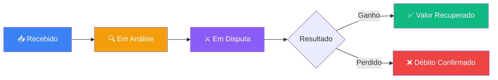

# ⚡ ChargeGuard — Sistema de Automação de Chargebacks

Sistema completo de automação e gestão de chargebacks com fluxo automatizado, dashboard interativo e relatórios analíticos.

> [!IMPORTANT]
> Para abrir o sistema, acesse `http://127.0.0.1:8080` com o servidor local rodando, ou abra o arquivo [index.html](file:///c:/Users/Vinicius/Documents/automacao%20teste/index.html) diretamente no navegador.

---

## 📄 Arquivos do Projeto

| Arquivo | Descrição |
|---------|-----------|
| [index.html](file:///c:/Users/Vinicius/Documents/automacao%20teste/index.html) | Estrutura HTML completa do sistema |
| [styles.css](file:///c:/Users/Vinicius/Documents/automacao%20teste/styles.css) | Design system com tema escuro premium |
| [app.js](file:///c:/Users/Vinicius/Documents/automacao%20teste/app.js) | Toda a lógica de automação e interatividade |

---

## 🖥️ Páginas do Sistema

````carousel
### 1. Dashboard


Visão geral com métricas em tempo real: Total de Chargebacks, Em Disputa, Valor Recuperado e Taxa de Sucesso. Inclui gráfico de tendência e donut chart de motivos.
<!-- slide -->
### 2. Novo Chargeback


Formulário completo com seções para: Dados do Cliente, Dados da Transação, Detalhes do Chargeback e upload de Evidências.
<!-- slide -->
### 3. Gestão de Casos


Tabela interativa com filtros por status (Recebido, Em Análise, Em Disputa, Ganho, Perdido), busca e exportação CSV.
<!-- slide -->
### 4. Fluxo Automatizado


Pipeline visual estilo Kanban com 4 etapas: Recebido → Em Análise → Em Disputa → Resolução. Cada caso pode ser visualizado e avançado.
<!-- slide -->
### 5. Relatórios


Gráficos detalhados: Resumo Mensal (barras), Distribuição por Status (donut), Chargebacks por Bandeira (barras horizontais) e KPIs com indicadores circulares.
````

---

## 🔄 Fluxo de Automação



### Etapas do Pipeline:

| Etapa | Automação |
|-------|-----------|
| **1. Recebido** | Registro automático, notificação à equipe, cálculo de prazo |
| **2. Em Análise** | Coleta de evidências, análise de viabilidade, preparação de defesa |
| **3. Em Disputa** | Envio da defesa, acompanhamento, alertas de prazo |
| **4. Resolução** | Registro do resultado, atualização financeira, relatório final |

> [!TIP]
> Ao registrar um novo chargeback, o sistema **automaticamente** move o caso para "Em Análise" após 3 segundos, simulando a automação do fluxo.

---

## ✨ Funcionalidades

### Registro de Chargebacks
- Formulário completo com dados do cliente, transação e detalhes
- Upload de evidências (drag & drop)
- Suporte a bandeiras: Visa, Mastercard, Elo, Amex, Hipercard
- 8 motivos pré-definidos (fraude, produto não recebido, etc.)

### Gestão de Casos
- Filtros por status com chips interativos
- Busca por ID, nome ou email do cliente
- Ações rápidas: visualizar detalhes, avançar etapa
- Checkbox para seleção múltipla
- **Exportação CSV** com todos os dados

### Dashboard
- 4 métricas principais com animação de contagem
- Gráfico de linha (Canvas) — tendência dos últimos 7 dias
- Gráfico donut — motivos mais frequentes
- Tabela de casos recentes com ações rápidas

### Sistema de Notificações
- Painel lateral de notificações
- Badge com contador de não-lidas
- Tipos: alerta, aviso, informação, sucesso
- Notificações automáticas ao avançar casos

### Modal de Detalhes
- Informações completas do caso
- Timeline/histórico de eventos
- Opções de ação: avançar etapa ou marcar como perdido

### Relatórios
- Gráfico de barras — resumo mensal (recebidos vs ganhos)
- Gráfico donut — distribuição por status
- Gráfico horizontal — volume por bandeira
- KPIs com indicadores circulares animados

---

## 🎨 Design & UX
- **Tema escuro premium** com cores harmoniosas
- **Tipografia**: Inter (Google Fonts)
- **Animações suaves**: fade-in, toasts, contadores
- **Responsivo**: adaptado para mobile e desktop
- **Glassmorphism**: header com backdrop-filter
